# Changelog

[voir ici](changelog.md)

## Installation

Le plugin ne necessite l'installation d'aucune dépendance. il vous faudra uniquement un compte sur le site internet : [data.rte-france](http://data.rte-france.com/) afin d'obtenir vos propores identifiants pour récupérer la météo énergétique actualisée (un appel autorisé toutes les 15 minutes à API). 

  

<h3>Détails paramétrage :</h3>

 

 1. Rendez vous sur : [data.rte-france](http://data.rte-france.com/). Puis se connecter :
 

 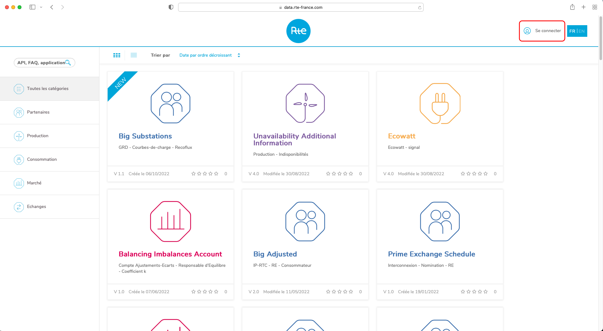</td>
 

  2. S'incrire et se connecter après validation de votre compte par mail :
 

 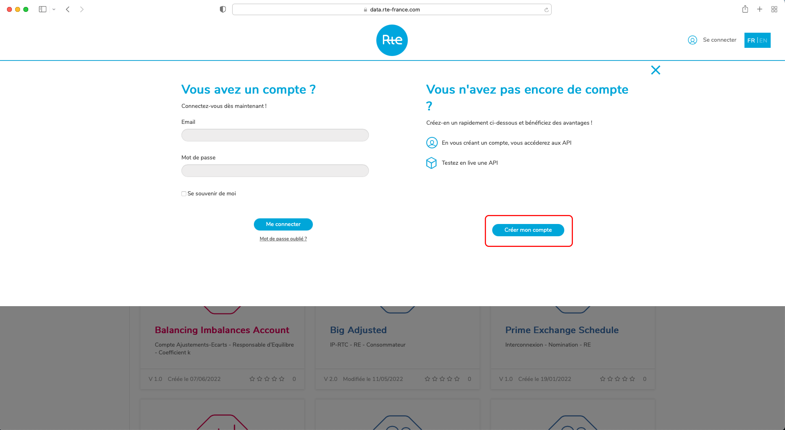</td>
 

  3. Chercher Ecowatt à gauche dans la zone de recherche ou trouvez le parmis les services proposés :
 

 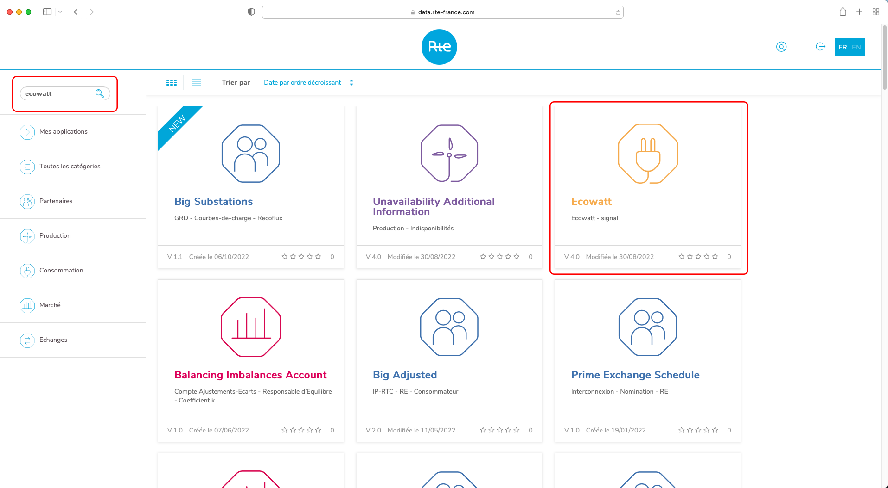</td>
 

  4. Abonnez-vous à l'API :
 

 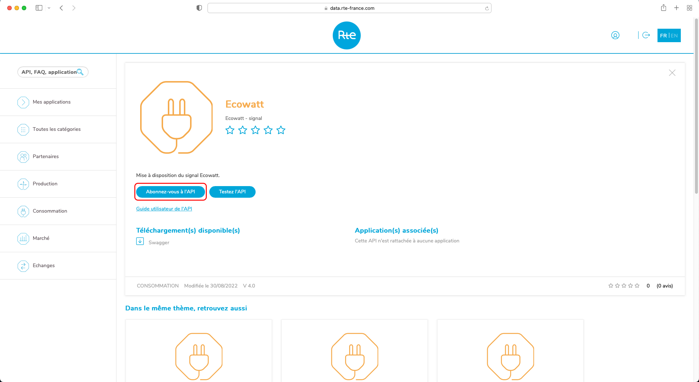</td>
 

   5. Remplissez les infos demandés :
 

 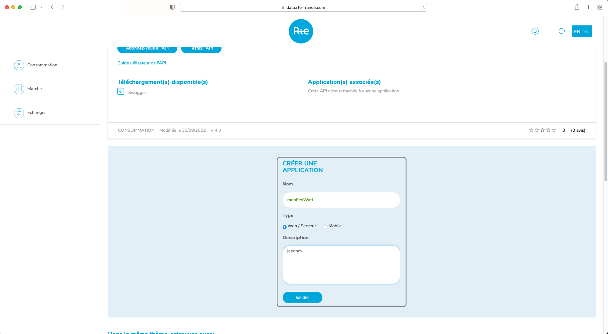</td>
 

    6. Allez dans "Mes applications" :
 

 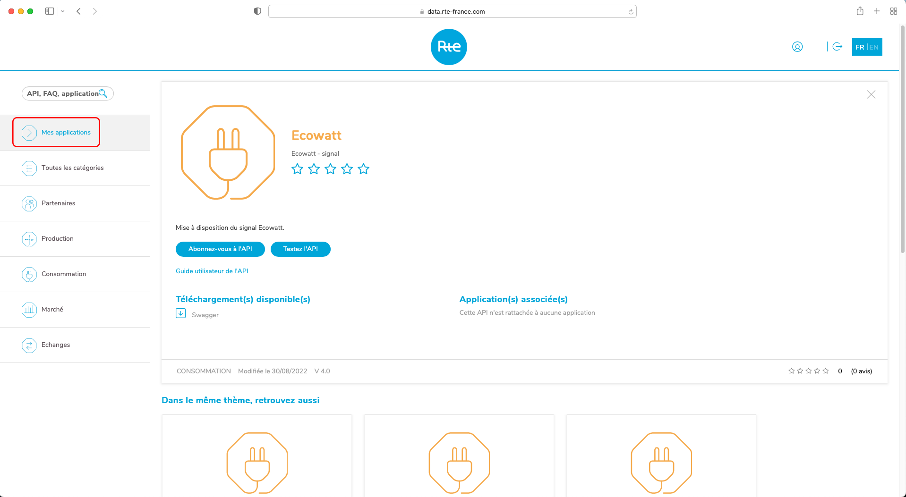</td>
 

    7. Copiez le "ID Client" et le "ID Secret", vous en aurez besoin par la suite :
 

 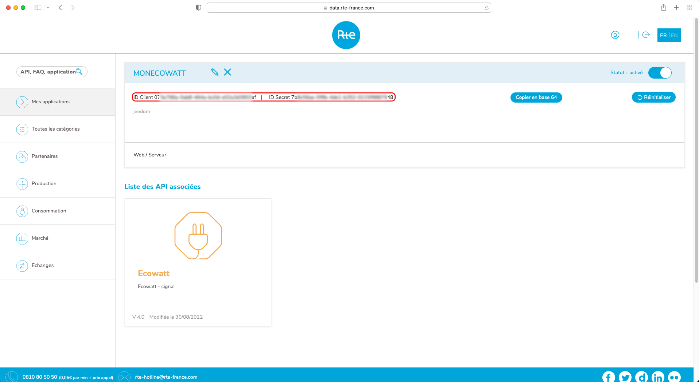</td>
 

    8. De retour sur Jeedom placez "ID Client" et le "ID Secret" dans les zone textuelle. Activer et rendez le visible dans un objet parent :
 

 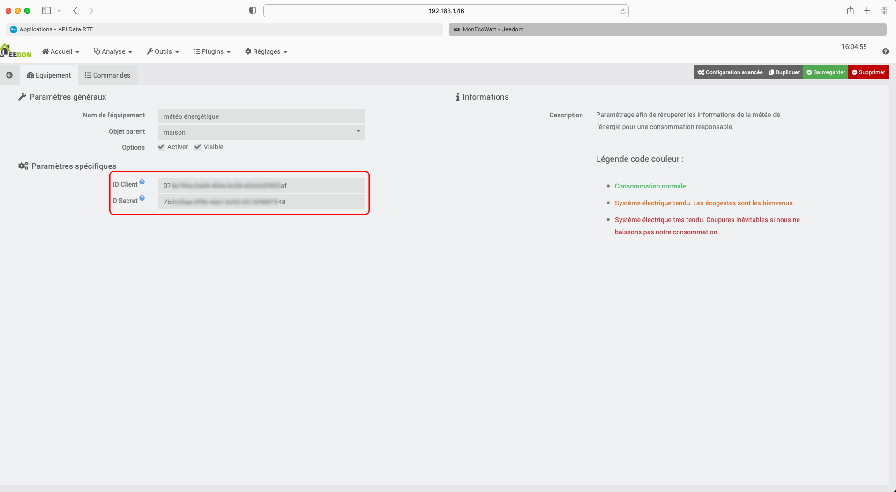</td>
 

    9. Félicitation vous recevez la météo énergétique :) :
 

 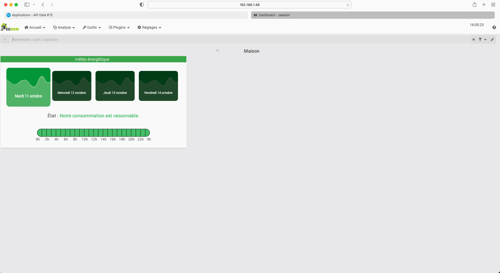</td>
 

## Présentation

Ce plugin permetra la récupération de la météo énergétique afin d'aider les français à mieux consommer l'électricité.  
Véritable météo de l'électricité, monEcoWatt va vous permetre de récupérer en temps réel le niveau de conommation des français. A chaque instant, les vignettes vous permetrons de changer les informations du jour (sur 4 jours au maximum) puis une fourchette heure par heure vous indiquera les moments fort ou faible, afin d'adopter de bons gestes a tenir pour assurer le bon approvisionnement de tous en énergie.

 

 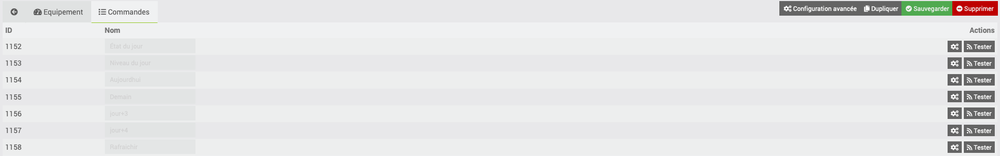</td>
 
1. Message du jour parmis 3 niveaux : (raisonnable, tendu, très tendu).

 
2. Niveau du jour parmis 3 niveaux : (1, 2,3).

 
3. Météo énergétique actuelle.

 
4. Météo énergétique de demain.

 
5. Météo énergétique à jour + 3.

 
6. Météo énergétique à jour + 4

 

   

<table width=100%>
<tr>
  <tr>
    <td align="center">Dashboard : système raisonnable</td>
    <td align="center">Dashboard : système tendu</td>
    <td align="center">Dashboard : système très tendu</td>
  </tr>
  <tr>
    <td>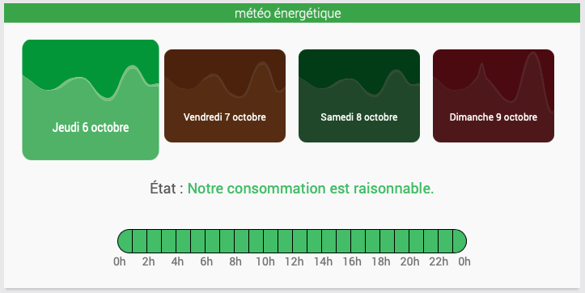</td>
    <td>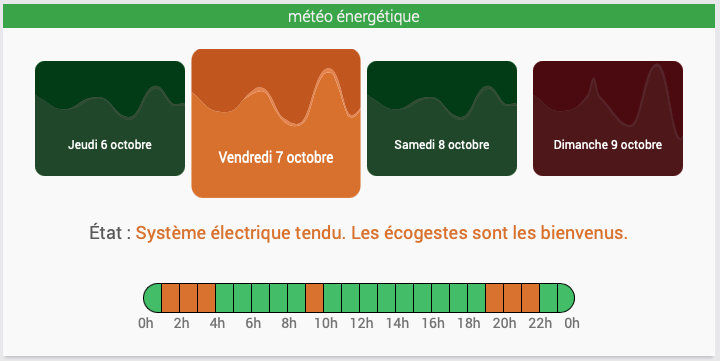</td>
    <td>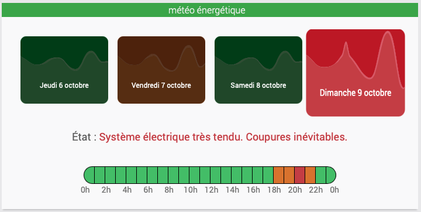</td>
  </tr>
  </tr>
  <tr height="75px"/>
  <tr>
  <tr>
    <td align="center">Dashboard mobile : système raisonnable</td>
    <td align="center">Dashboard mobile : système tendu</td>
    <td align="center">Dashboard mobile : système très tendu</td>
  </tr>
  <tr>
    <td>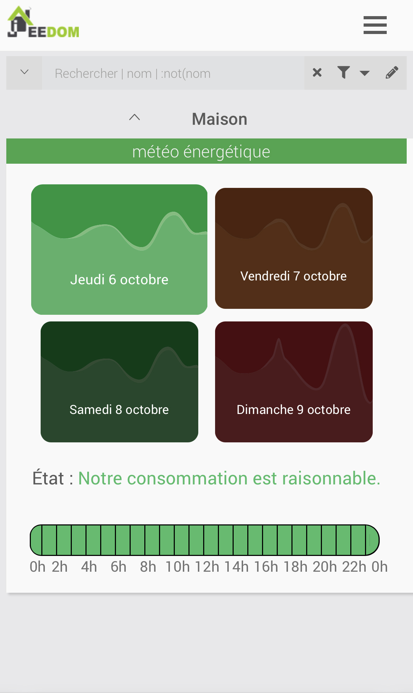</td>
    <td>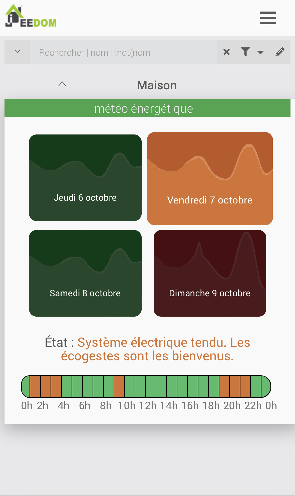</td>
    <td>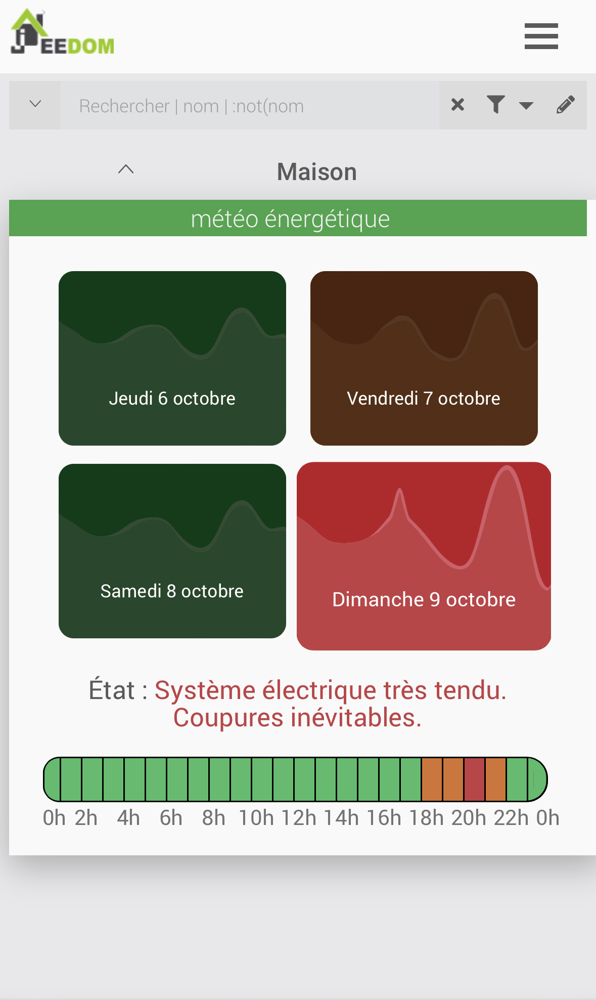</td>
  </tr>
  </tr>
  <tr height="75px"/>
  <tr>
  <tr>
    <td align="center">Mobile : système raisonnable</td>
    <td align="center">Mobile : système tendu</td>
    <td align="center">Mobile : système très tendu</td>
  </tr>
  <tr>
    <td>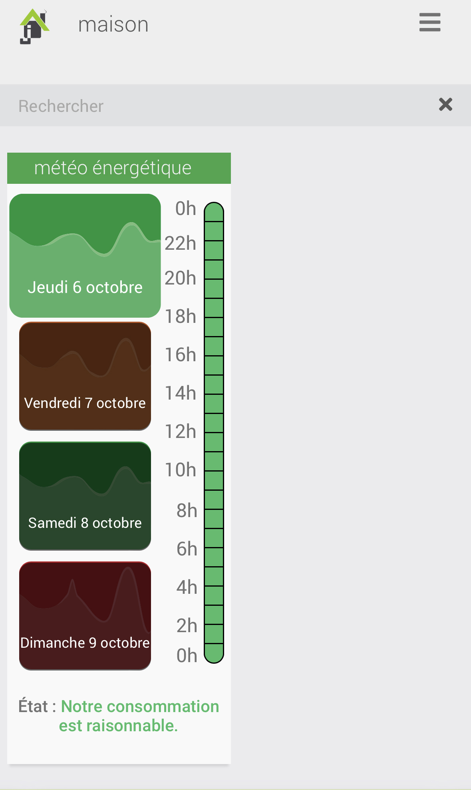</td>
    <td>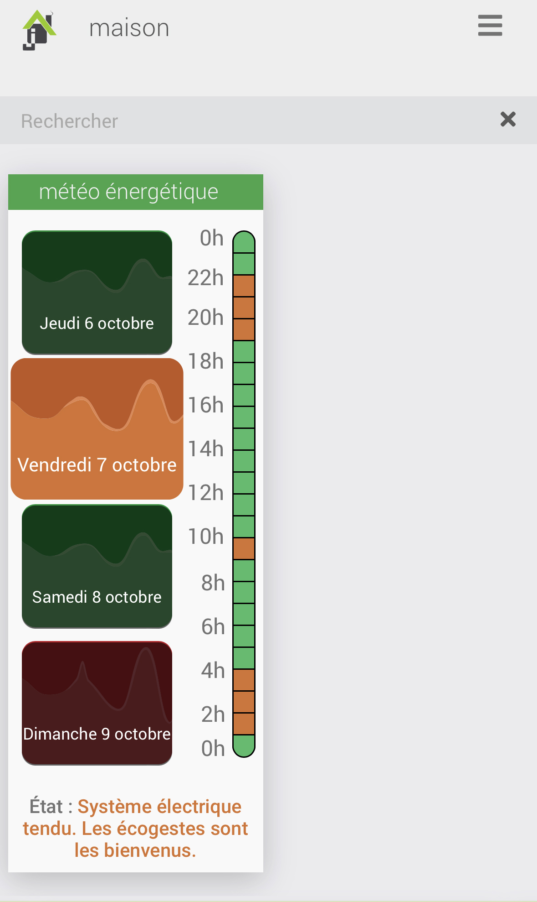</td>
    <td>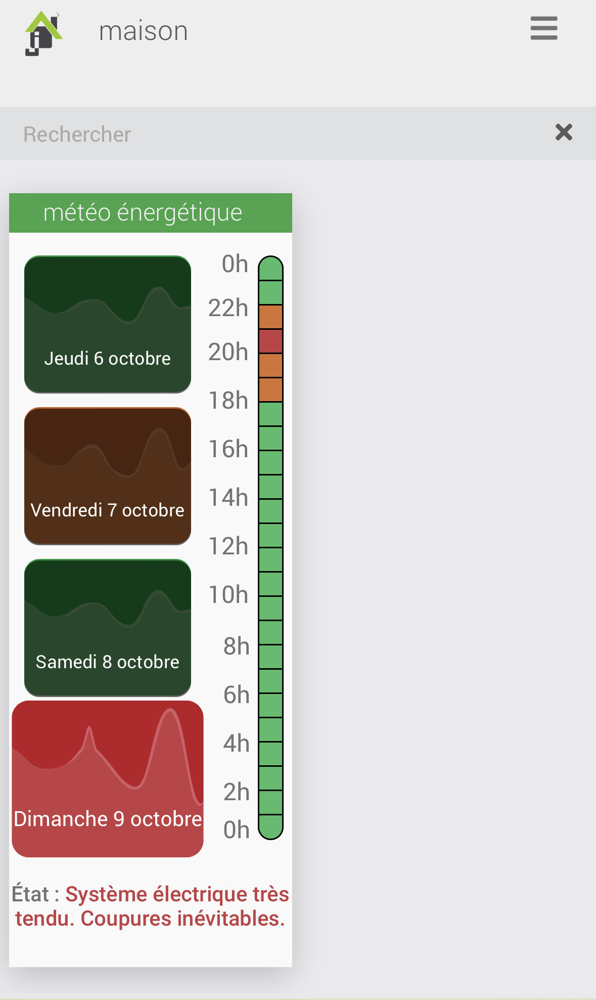</td>
  </tr>
  </tr>
 </table>
